# MCP Backend — Use Cases, Flussi e Architettura

> Documento complementare a [BACKEND_DOCS.md](./BACKEND_DOCS.md).  
> Tutti i diagrammi sono in sintassi **Mermaid** e vengono renderizzati automaticamente da VSCode (con estensione), GitHub, GitLab e la maggior parte dei visualizzatori Markdown.

---

## Indice

- [1. Architettura Generale](#1-architettura-generale)
- [2. Modello Dati (Firestore Collections)](#2-modello-dati-firestore-collections)
- [3. Mappa Use Cases](#3-mappa-use-cases)
- [4. Use Cases Pubblici](#4-use-cases-pubblici)
  - [UC-01: Visualizzazione Eventi](#uc-01-visualizzazione-eventi)
  - [UC-02: Validazione Partecipanti](#uc-02-validazione-partecipanti-pre-acquisto)
  - [UC-03: Acquisto Biglietto - Create Order](#uc-03-acquisto-biglietto--paypal-create-order)
  - [UC-04: Acquisto Biglietto - Capture Order](#uc-04-acquisto-biglietto--paypal-capture-order)
  - [UC-05: Iscrizione Newsletter](#uc-05-iscrizione-newsletter)
  - [UC-06: Form Contatti](#uc-06-form-contatti)
- [5. Use Cases Admin](#5-use-cases-admin)
  - [UC-07: Autenticazione Admin](#uc-07-autenticazione-admin)
  - [UC-08: Gestione Eventi](#uc-08-gestione-eventi-cru d)
  - [UC-09: Gestione Partecipanti](#uc-09-gestione-partecipanti)
  - [UC-10: Invio Posizione Massivo](#uc-10-invio-posizione-massivo-async-job)
  - [UC-11: Gestione Membership](#uc-11-gestione-membership)
  - [UC-12: Merge Membership Duplicate](#uc-12-merge-membership-duplicate)
  - [UC-13: Wallet Pass Pass2U](#uc-13-wallet-pass-pass2u)
- [6. Use Cases Entrata Evento (QR)](#6-use-cases-entrata-evento-qr)
  - [UC-14: Generazione Scan Token](#uc-14-generazione-scan-token)
  - [UC-15: Validazione Accesso QR](#uc-15-validazione-accesso-tramite-qr)
- [7. Triggers Automatici](#7-triggers-automatici)
  - [UC-16: Trigger on_participant_created](#uc-16-trigger-onparticipantcreated)
  - [UC-17: Trigger on_membership_created](#uc-17-trigger-onmembershipcreated)
  - [UC-18: Trigger Jobs (Invio Posizione)](#uc-18-trigger-jobs-invio-posizione)
  - [UC-19: Trigger Capodanno](#uc-19-trigger-capodanno-rinnovi)
- [8. Webhooks](#8-webhooks)
  - [UC-20: Sender.net Webhook](#uc-20-sendernet-webhook)
- [9. Integrazioni Esterne](#9-integrazioni-esterne)
- [10. State Machines](#10-state-machines)
- [11. Matrice Collections ↔ Use Cases](#11-matrice-collections--use-cases)

---

## 1. Architettura Generale

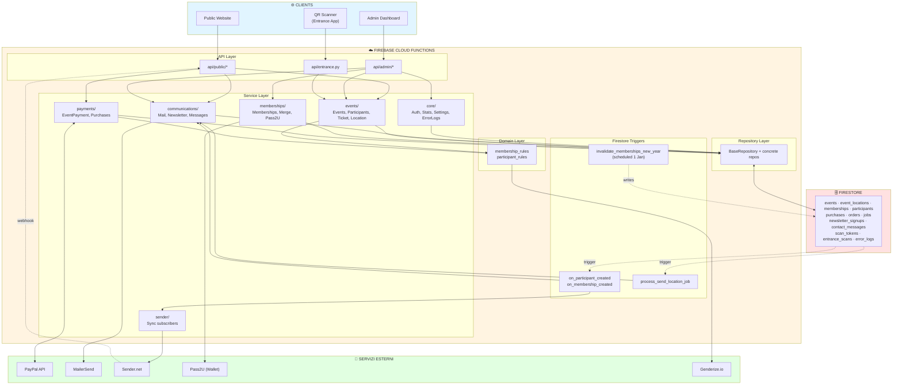
```mermaid
graph TB
    subgraph Clients["🌐 CLIENTS"]
        PubWeb["Public Website"]
        AdminUI["Admin Dashboard"]
        QRScanner["QR Scanner<br/>(Entrance App)"]
    end

    subgraph FirebaseFunctions["☁️ FIREBASE CLOUD FUNCTIONS"]
        subgraph APILayer["API Layer"]
            PubAPI["api/public/*"]
            AdminAPI["api/admin/*"]
            EntranceAPI["api/entrance.py"]
        end

        subgraph ServiceLayer["Service Layer"]
            CoreSvc["core/<br/>Auth, Stats, Settings, ErrorLogs"]
            CommSvc["communications/<br/>Mail, Newsletter, Messages"]
            EventSvc["events/<br/>Events, Participants, Ticket, Location"]
            MembSvc["memberships/<br/>Memberships, Merge, Pass2U"]
            PaySvc["payments/<br/>EventPayment, Purchases"]
            SyncSvc["sender/<br/>Sync subscribers"]
        end

        subgraph DomainLayer["Domain Layer"]
            Rules["membership_rules<br/>participant_rules"]
        end

        subgraph RepoLayer["Repository Layer"]
            Repos["BaseRepository + concrete repos"]
        end

        subgraph Triggers["Firestore Triggers"]
            RegTrig["on_participant_created<br/>on_membership_created"]
            JobTrig["process_send_location_job"]
            NYTrig["invalidate_memberships_new_year<br/>(scheduled 1 Jan)"]
        end
    end

    subgraph Firestore["🗄️ FIRESTORE"]
        FSDocs["events · event_locations · memberships · participants<br/>purchases · orders · jobs<br/>newsletter_signups · contact_messages<br/>scan_tokens · entrance_scans · error_logs"]
    end

    subgraph External["🔌 SERVIZI ESTERNI"]
        PayPal["PayPal API"]
        MailerSend["MailerSend"]
        Sender["Sender.net"]
        Pass2U["Pass2U (Wallet)"]
        Genderize["Genderize.io"]
    end

    PubWeb --> PubAPI
    AdminUI --> AdminAPI
    QRScanner --> EntranceAPI

    PubAPI --> CommSvc
    PubAPI --> EventSvc
    PubAPI --> PaySvc
    AdminAPI --> CoreSvc
    AdminAPI --> EventSvc
    AdminAPI --> MembSvc
    AdminAPI --> CommSvc
    EntranceAPI --> EventSvc

    CoreSvc --> Repos
    CommSvc --> Repos
    EventSvc --> Rules
    EventSvc --> Repos
    MembSvc --> Repos
    PaySvc --> Rules
    PaySvc --> Repos

    Repos <--> FSDocs

    FSDocs -.trigger.-> RegTrig
    FSDocs -.trigger.-> JobTrig
    NYTrig -.writes.-> FSDocs

    RegTrig --> SyncSvc
    RegTrig --> CommSvc
    JobTrig --> CommSvc

    PaySvc <--> PayPal
    CommSvc --> MailerSend
    SyncSvc --> Sender
    Sender -.webhook.-> PubAPI
    MembSvc --> Pass2U
    Rules --> Genderize

    style Clients fill:#e1f5ff
    style FirebaseFunctions fill:#fff4e1
    style Firestore fill:#ffe1e1
    style External fill:#e1ffe1
```

### Layered Architecture

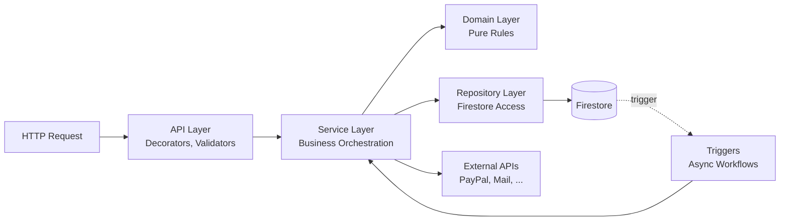
```mermaid
graph LR
    A[HTTP Request] --> B[API Layer<br/>Decorators, Validators]
    B --> C[Service Layer<br/>Business Orchestration]
    C --> D[Domain Layer<br/>Pure Rules]
    C --> E[Repository Layer<br/>Firestore Access]
    E --> F[(Firestore)]
    C --> G[External APIs<br/>PayPal, Mail, ...]
    F -.trigger.-> H[Triggers<br/>Async Workflows]
    H --> C
```

---

## 2. Modello Dati (Firestore Collections)

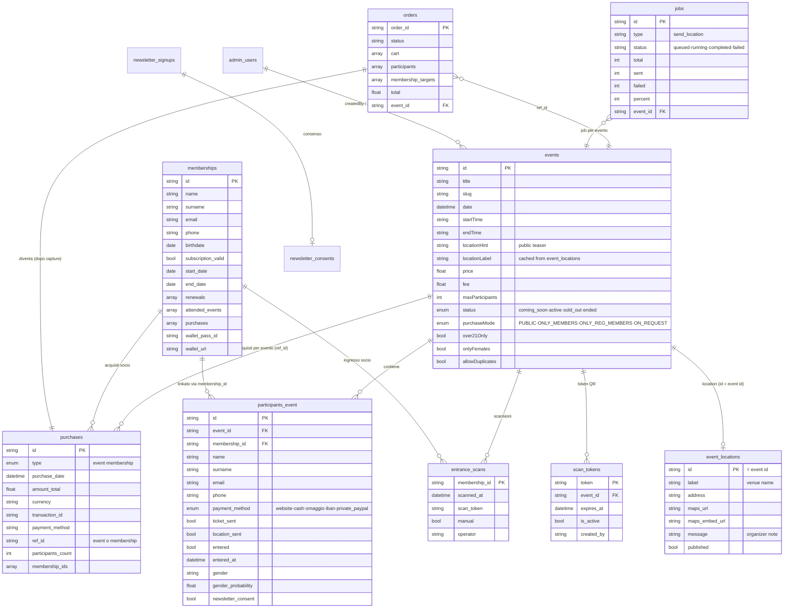
```mermaid
erDiagram
    events ||--o{ participants_event : "contiene"
    events ||--o{ purchases : "acquisti per evento (ref_id)"
    events ||--o{ scan_tokens : "token QR"
    events ||--o{ entrance_scans : "scansioni"
    events ||--o| event_locations : "location (id = event id)"

    memberships ||--o{ participants_event : "linkato via membership_id"
    memberships ||--o{ purchases : "acquisti socio"
    memberships ||--o{ entrance_scans : "ingresso socio"

    orders ||--|| purchases : "diventa (dopo capture)"
    orders }o--|| events : "ref_id"

    jobs }o--|| events : "job per evento"

    newsletter_signups ||--o| newsletter_consents : "consenso"

    admin_users ||--o{ events : "createdBy / updatedBy"

    events {
        string id PK
        string title
        string slug
        datetime date
        string startTime
        string endTime
        string locationHint "public teaser"
        string locationLabel "cached from event_locations"
        float price
        float fee
        int maxParticipants
        enum status "coming_soon·active·sold_out·ended"
        enum purchaseMode "PUBLIC·ONLY_MEMBERS·ONLY_REG_MEMBERS·ON_REQUEST"
        bool over21Only
        bool onlyFemales
        bool allowDuplicates
    }

    event_locations {
        string id PK "= event id"
        string label "venue name"
        string address
        string maps_url
        string maps_embed_url
        string message "organizer note"
        bool published
    }

    memberships {
        string id PK
        string name
        string surname
        string email
        string phone
        date birthdate
        bool subscription_valid
        date start_date
        date end_date
        array renewals
        array attended_events
        array purchases
        string wallet_pass_id
        string wallet_url
    }

    participants_event {
        string id PK
        string event_id FK
        string membership_id FK
        string name
        string surname
        string email
        string phone
        enum payment_method "website·cash·omaggio·iban·private_paypal"
        bool ticket_sent
        bool location_sent
        bool entered
        datetime entered_at
        string gender
        float gender_probability
        bool newsletter_consent
    }

    purchases {
        string id PK
        enum type "event·membership"
        datetime purchase_date
        float amount_total
        string currency
        string transaction_id
        string payment_method
        string ref_id "event o membership"
        int participants_count
        array membership_ids
    }

    orders {
        string order_id PK
        string status
        array cart
        array participants
        array membership_targets
        float total
        string event_id FK
    }

    jobs {
        string id PK
        string type "send_location"
        string status "queued·running·completed·failed"
        int total
        int sent
        int failed
        int percent
        string event_id FK
    }

    scan_tokens {
        string token PK
        string event_id FK
        datetime expires_at
        bool is_active
        string created_by
    }

    entrance_scans {
        string membership_id PK
        datetime scanned_at
        string scan_token
        bool manual
        string operator
    }
```

---

## 3. Mappa Use Cases

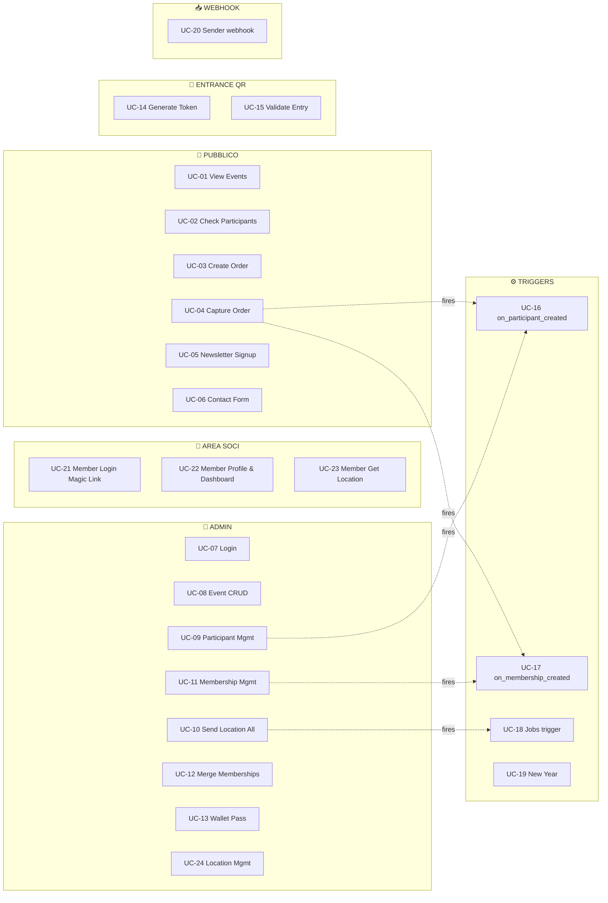
```mermaid
graph LR
    subgraph Pubblico["👤 PUBBLICO"]
        P1[UC-01 View Events]
        P2[UC-02 Check Participants]
        P3[UC-03 Create Order]
        P4[UC-04 Capture Order]
        P5[UC-05 Newsletter Signup]
        P6[UC-06 Contact Form]
    end

    subgraph Member["🪪 AREA SOCI"]
        M1[UC-21 Member Login Magic Link]
        M2[UC-22 Member Profile & Dashboard]
        M3[UC-23 Member Get Location]
    end

    subgraph Admin["🔐 ADMIN"]
        A1[UC-07 Login]
        A2[UC-08 Event CRUD]
        A3[UC-09 Participant Mgmt]
        A4[UC-10 Send Location All]
        A5[UC-11 Membership Mgmt]
        A6[UC-12 Merge Memberships]
        A7[UC-13 Wallet Pass]
        A8[UC-24 Location Mgmt]
    end

    subgraph Entrance["📱 ENTRANCE QR"]
        E1[UC-14 Generate Token]
        E2[UC-15 Validate Entry]
    end

    subgraph Async["⚙️ TRIGGERS"]
        T1[UC-16 on_participant_created]
        T2[UC-17 on_membership_created]
        T3[UC-18 Jobs trigger]
        T4[UC-19 New Year]
    end

    subgraph Webhook["📥 WEBHOOK"]
        W1[UC-20 Sender webhook]
    end

    P4 -.fires.-> T1
    P4 -.fires.-> T2
    A3 -.fires.-> T1
    A5 -.fires.-> T2
    A4 -.fires.-> T3
```

---

## 4. Use Cases Pubblici

### UC-01: Visualizzazione Eventi

**Attore**: utente pubblico anonimo

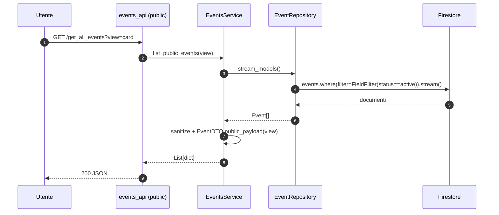
```mermaid
sequenceDiagram
    autonumber
    participant U as Utente
    participant API as events_api (public)
    participant S as EventsService
    participant R as EventRepository
    participant FS as Firestore

    U->>API: GET /get_all_events?view=card
    API->>S: list_public_events(view)
    S->>R: stream_models()
    R->>FS: events.where(filter=FieldFilter(status==active)).stream()
    FS-->>R: documenti
    R-->>S: Event[]
    S->>S: sanitize + EventDTO.public_payload(view)
    S-->>API: List[dict]
    API-->>U: 200 JSON
```

**Varianti**: `GET /get_next_event`, `GET /get_event_by_id?id=X&slug=Y`.

**Collections**: `events` (read).  
**External**: nessuna.

---

### UC-02: Validazione Partecipanti (Pre-Acquisto)

**Attore**: utente anonimo in checkout.

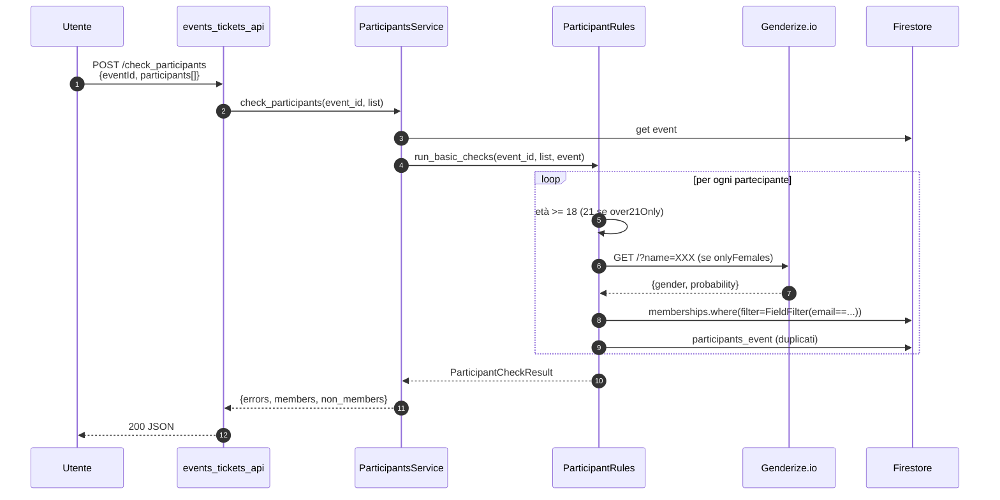
```mermaid
sequenceDiagram
    autonumber
    participant U as Utente
    participant API as events_tickets_api
    participant PS as ParticipantsService
    participant PR as ParticipantRules
    participant GZ as Genderize.io
    participant FS as Firestore

    U->>API: POST /check_participants<br/>{eventId, participants[]}
    API->>PS: check_participants(event_id, list)
    PS->>FS: get event
    PS->>PR: run_basic_checks(event_id, list, event)
    loop per ogni partecipante
        PR->>PR: età >= 18 (21 se over21Only)
        PR->>GZ: GET /?name=XXX (se onlyFemales)
        GZ-->>PR: {gender, probability}
        PR->>FS: memberships.where(filter=FieldFilter(email==...))
        PR->>FS: participants_event (duplicati)
    end
    PR-->>PS: ParticipantCheckResult
    PS-->>API: {errors, members, non_members}
    API-->>U: 200 JSON
```

**Regole validate** (in `domain/participant_rules.py`):
- Età ≥ 18 (blocco minorenni) — 21 se `over21Only=true`
- Duplicati (email/telefono) nel form e nel DB, salvo `allowDuplicates=true`
- Restrizione solo donne (chiamata Genderize se `onlyFemales=true`)
- Verifica socio attivo se `purchaseMode` lo richiede
- Rilevamento mismatch identità (email nota con nome diverso)

**Collections**: `events`, `memberships`, `participants_event` (read).  
**External**: Genderize.io (condizionale).

---

### UC-03: Acquisto Biglietto — PayPal Create Order

**Attore**: utente in checkout.

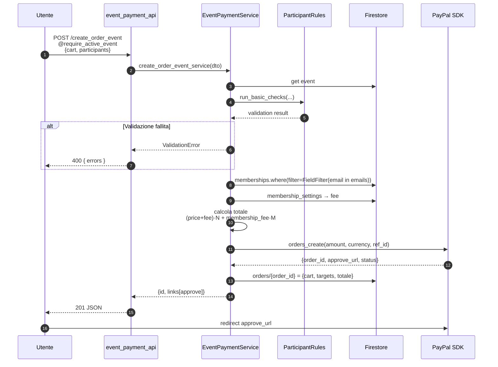
```mermaid
sequenceDiagram
    autonumber
    participant U as Utente
    participant API as event_payment_api
    participant EP as EventPaymentService
    participant PR as ParticipantRules
    participant FS as Firestore
    participant PP as PayPal SDK

    U->>API: POST /create_order_event<br/>@require_active_event<br/>{cart, participants}
    API->>EP: create_order_event_service(dto)
    EP->>FS: get event
    EP->>PR: run_basic_checks(...)
    PR-->>EP: validation result
    alt Validazione fallita
        EP-->>API: ValidationError
        API-->>U: 400 { errors }
    end
    EP->>FS: memberships.where(filter=FieldFilter(email in emails))
    EP->>FS: membership_settings → fee
    EP->>EP: calcola totale<br/>(price+fee)·N + membership_fee·M
    EP->>PP: orders_create(amount, currency, ref_id)
    PP-->>EP: {order_id, approve_url, status}
    EP->>FS: orders/{order_id} = {cart, targets, totale}
    EP-->>API: {id, links[approve]}
    API-->>U: 201 JSON
    U->>PP: redirect approve_url
```

**Logica `purchaseMode`** (dove M = nuovi soci):
| Mode | Comportamento |
|---|---|
| `PUBLIC` | nessun vincolo, M = 0 |
| `ONLY_MEMBERS` | i non-soci creano nuova membership (M > 0) |
| `ONLY_ALREADY_REGISTERED_MEMBERS` | reject non-soci |
| `ON_REQUEST` | reject, gestione manuale admin |

**Collections**: `events`, `memberships`, `membership_settings`, `participants_event` (read); `orders` (write).  
**External**: PayPal.

---

### UC-04: Acquisto Biglietto — PayPal Capture Order

**Attore**: utente di ritorno da PayPal.

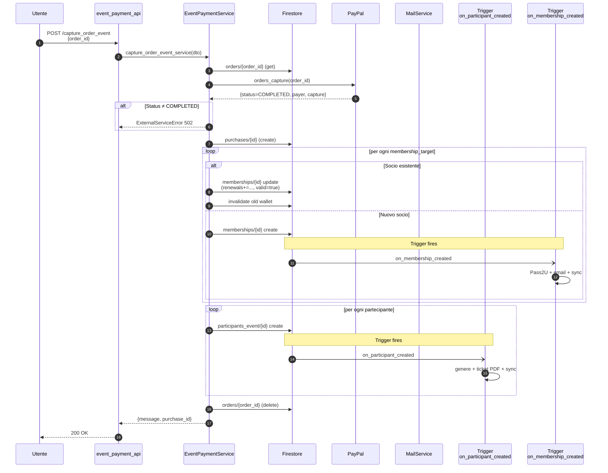
```mermaid
sequenceDiagram
    autonumber
    participant U as Utente
    participant API as event_payment_api
    participant EP as EventPaymentService
    participant FS as Firestore
    participant PP as PayPal
    participant MS as MailService
    participant T1 as Trigger<br/>on_participant_created
    participant T2 as Trigger<br/>on_membership_created

    U->>API: POST /capture_order_event<br/>{order_id}
    API->>EP: capture_order_event_service(dto)
    EP->>FS: orders/{order_id} (get)
    EP->>PP: orders_capture(order_id)
    PP-->>EP: {status=COMPLETED, payer, capture}
    alt Status ≠ COMPLETED
        EP-->>API: ExternalServiceError 502
    end
    EP->>FS: purchases/{id} (create)
    loop per ogni membership_target
        alt Socio esistente
            EP->>FS: memberships/{id} update<br/>(renewals+=..., valid=true)
            EP->>FS: invalidate old wallet
        else Nuovo socio
            EP->>FS: memberships/{id} create
            Note over FS,T2: Trigger fires
            FS-)T2: on_membership_created
            T2->>T2: Pass2U + email + sync
        end
    end
    loop per ogni partecipante
        EP->>FS: participants_event/{id} create
        Note over FS,T1: Trigger fires
        FS-)T1: on_participant_created
        T1->>T1: genere + ticket PDF + sync
    end
    EP->>FS: orders/{order_id} (delete)
    EP-->>API: {message, purchase_id}
    API-->>U: 200 OK
```

**Side effects in cascata**:
1. Purchase creato → lettura stats aggiornate
2. Membership created → trigger UC-17 (wallet + email + sync CRM)
3. Participant created → trigger UC-16 (ticket + newsletter + sync)

**Collections**: `orders` (read+delete), `events` (read), `memberships` (create/update), `participants_event` (create), `purchases` (create).  
**External**: PayPal, (indiretto via trigger: MailerSend, Pass2U, Sender, Genderize).

---

### UC-05: Iscrizione Newsletter

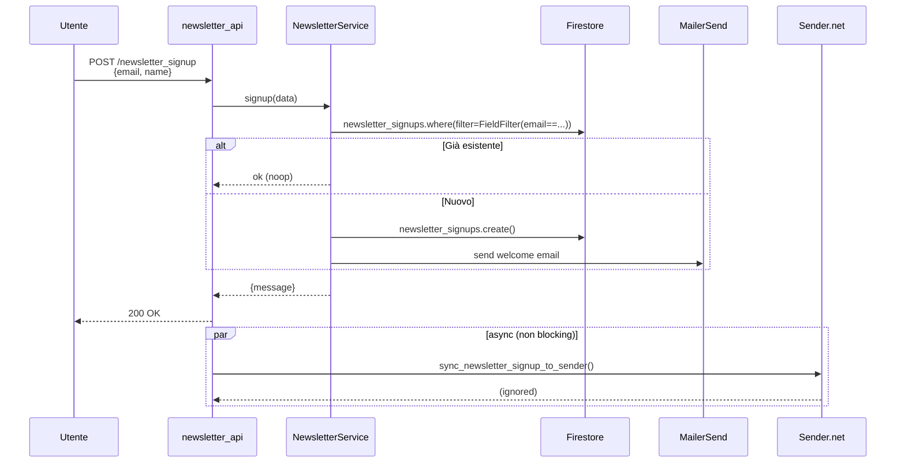
```mermaid
sequenceDiagram
    participant U as Utente
    participant API as newsletter_api
    participant NS as NewsletterService
    participant FS as Firestore
    participant MS as MailerSend
    participant SN as Sender.net

    U->>API: POST /newsletter_signup<br/>{email, name}
    API->>NS: signup(data)
    NS->>FS: newsletter_signups.where(filter=FieldFilter(email==...))
    alt Già esistente
        NS-->>API: ok (noop)
    else Nuovo
        NS->>FS: newsletter_signups.create()
        NS->>MS: send welcome email
    end
    NS-->>API: {message}
    API-->>U: 200 OK

    par async (non blocking)
        API->>SN: sync_newsletter_signup_to_sender()
        SN-->>API: (ignored)
    end
```

**Collections**: `newsletter_signups` (read/write).  
**External**: MailerSend, Sender.net (fire-and-forget).

---

### UC-06: Form Contatti

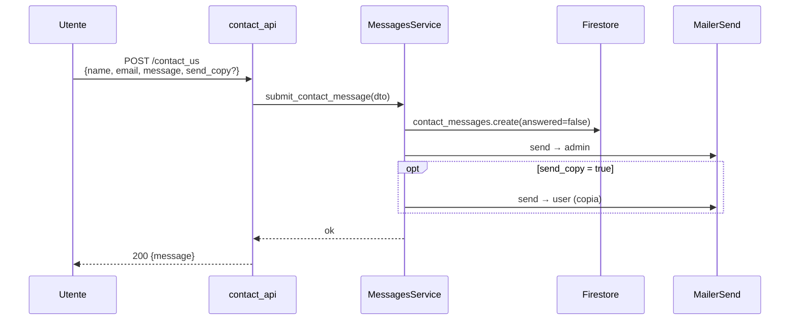
```mermaid
sequenceDiagram
    participant U as Utente
    participant API as contact_api
    participant MS as MessagesService
    participant FS as Firestore
    participant Mail as MailerSend

    U->>API: POST /contact_us<br/>{name, email, message, send_copy?}
    API->>MS: submit_contact_message(dto)
    MS->>FS: contact_messages.create(answered=false)
    MS->>Mail: send → admin
    opt send_copy = true
        MS->>Mail: send → user (copia)
    end
    MS-->>API: ok
    API-->>U: 200 {message}
```

**Collections**: `contact_messages` (write).  
**External**: MailerSend.

---

## 5. Use Cases Admin

### UC-07: Autenticazione Admin

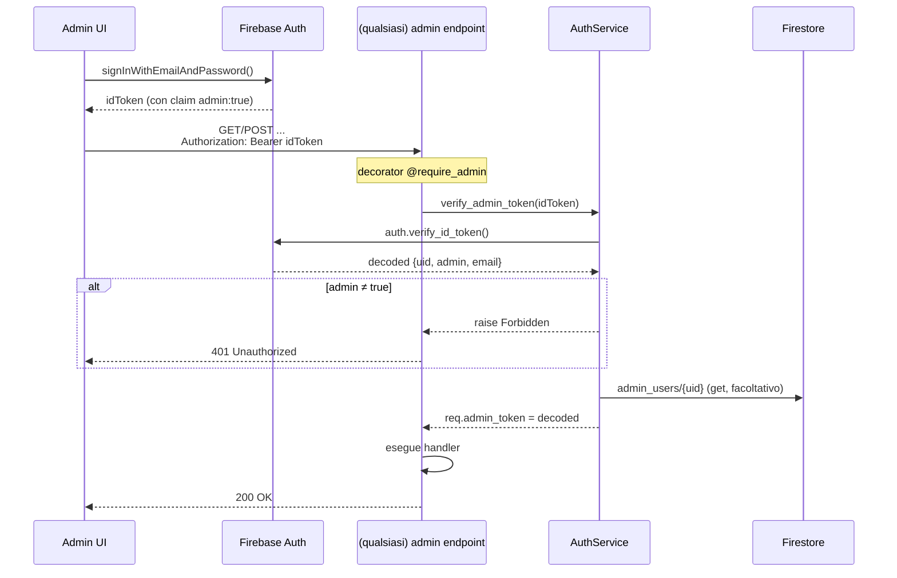
```mermaid
sequenceDiagram
    participant AUI as Admin UI
    participant FA as Firebase Auth
    participant API as (qualsiasi) admin endpoint
    participant AS as AuthService
    participant FS as Firestore

    AUI->>FA: signInWithEmailAndPassword()
    FA-->>AUI: idToken (con claim admin:true)
    AUI->>API: GET/POST ...<br/>Authorization: Bearer idToken
    Note over API: decorator @require_admin
    API->>AS: verify_admin_token(idToken)
    AS->>FA: auth.verify_id_token()
    FA-->>AS: decoded {uid, admin, email}
    alt admin ≠ true
        AS-->>API: raise Forbidden
        API-->>AUI: 401 Unauthorized
    end
    AS->>FS: admin_users/{uid} (get, facoltativo)
    AS-->>API: req.admin_token = decoded
    API->>API: esegue handler
    API-->>AUI: 200 OK
```

**Setup admin**: custom claim `admin:true` impostato con `auth.set_custom_user_claims()` (funzione `create_admin`).

---

### UC-08: Gestione Eventi (CRUD)

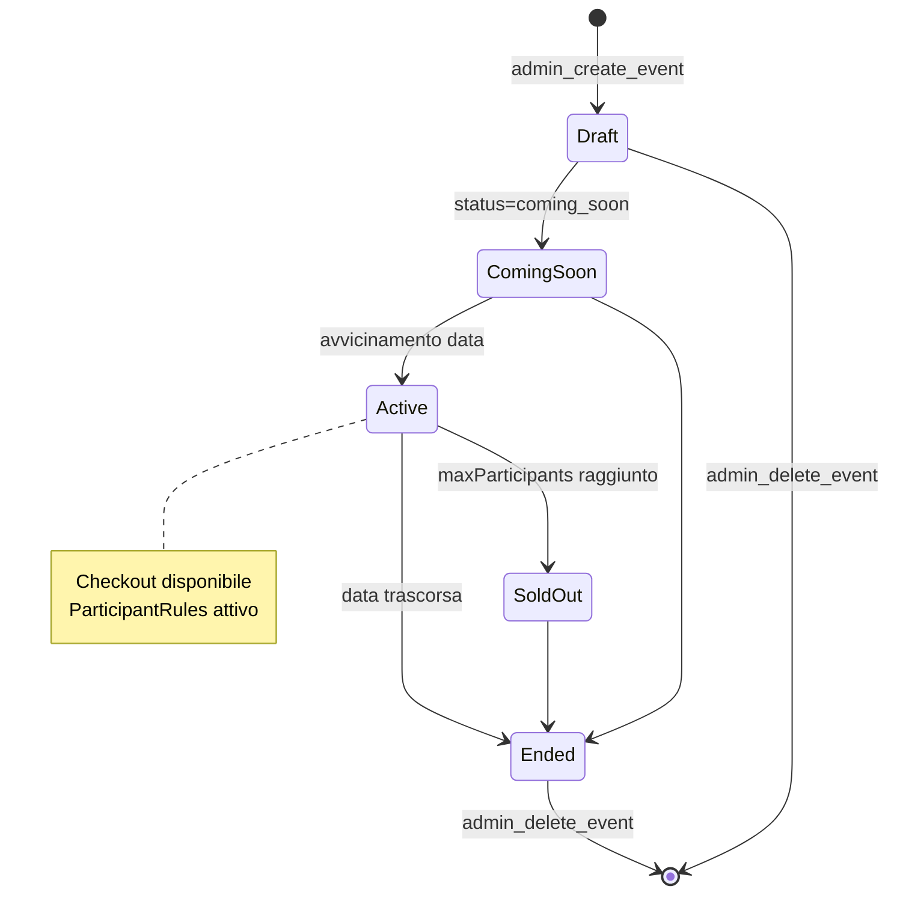
```mermaid
stateDiagram-v2
    [*] --> Draft: admin_create_event
    Draft --> ComingSoon: status=coming_soon
    ComingSoon --> Active: avvicinamento data
    Active --> SoldOut: maxParticipants raggiunto
    Active --> Ended: data trascorsa
    SoldOut --> Ended
    ComingSoon --> Ended
    Ended --> [*]: admin_delete_event
    Draft --> [*]: admin_delete_event

    note right of Active
        Checkout disponibile
        ParticipantRules attivo
    end note
```

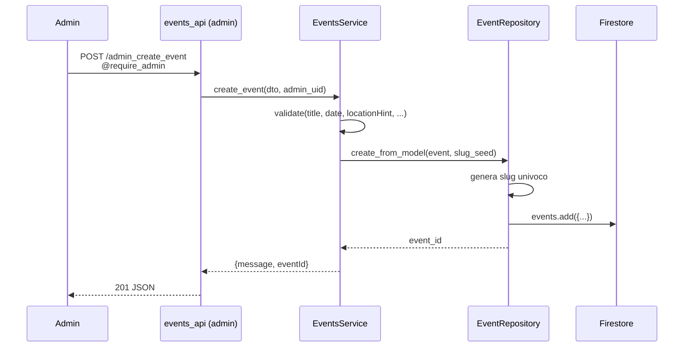
```mermaid
sequenceDiagram
    participant A as Admin
    participant API as events_api (admin)
    participant ES as EventsService
    participant ER as EventRepository
    participant FS as Firestore

    A->>API: POST /admin_create_event<br/>@require_admin
    API->>ES: create_event(dto, admin_uid)
    ES->>ES: validate(title, date, locationHint, ...)
    ES->>ER: create_from_model(event, slug_seed)
    ER->>ER: genera slug univoco
    ER->>FS: events.add({...})
    ER-->>ES: event_id
    ES-->>API: {message, eventId}
    API-->>A: 201 JSON
```

**Delete cascata**: `admin_delete_event` elimina `events/{id}` + subcollection `participants/{id}/participants_event/*`.

---

### UC-09: Gestione Partecipanti

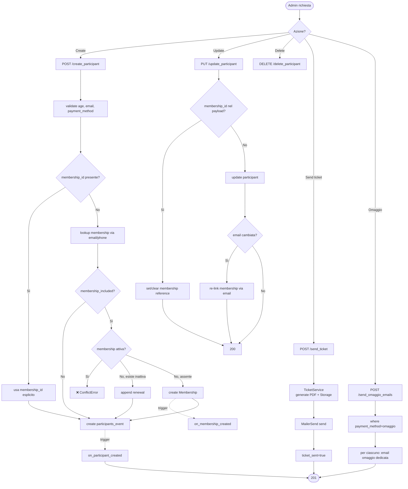
```mermaid
flowchart TD
    Start([Admin richiesta]) --> Action{Azione?}
    Action -->|Create| Create[POST /create_participant]
    Action -->|Update| Update[PUT /update_participant]
    Action -->|Delete| Delete[DELETE /delete_participant]
    Action -->|Send ticket| Ticket[POST /send_ticket]
    Action -->|Omaggio| Omaggio[POST /send_omaggio_emails]

    Create --> Validate[validate age, email, payment_method]
    Validate --> ExplicitMembership{membership_id presente?}
    ExplicitMembership -->|Sì| LinkExplicit[usa membership_id esplicito]
    ExplicitMembership -->|No| AutoLookup[lookup membership via email/phone]
    AutoLookup --> IncludeMembership{membership_included?}
    IncludeMembership -->|No| CreateParticipant[create participants_event]
    IncludeMembership -->|Sì| ExistsActive{membership attiva?}
    ExistsActive -->|Sì| Conflict[❌ ConflictError]
    ExistsActive -->|No, esiste inattiva| Renew[append renewal]
    ExistsActive -->|No, assente| NewMemb[create Membership]
    LinkExplicit --> CreateParticipant
    Renew --> CreateParticipant
    NewMemb -.trigger.-> OnMembCreated[on_membership_created]
    NewMemb --> CreateParticipant
    CreateParticipant -.trigger.-> OnPartCreated[on_participant_created]
    OnPartCreated --> End([201])

    Update --> OverrideCheck{membership_id nel payload?}
    OverrideCheck -->|Sì| ManualOverride[set/clear membership reference]
    OverrideCheck -->|No| UpdateDoc[update participant]
    ManualOverride --> DoneUpdate[200]
    UpdateDoc --> EmailChanged{email cambiata?}
    EmailChanged -->|Sì| Relink[re-link membership via email]
    EmailChanged -->|No| DoneUpdate
    Relink --> DoneUpdate

    Ticket --> GenPDF[TicketService<br/>generate PDF + Storage]
    GenPDF --> SendMail[MailerSend send]
    SendMail --> MarkSent[ticket_sent=true]
    MarkSent --> End

    Omaggio --> FilterOmaggio[where payment_method=omaggio]
    FilterOmaggio --> LoopOmaggio[per ciascuno: email omaggio dedicata]
    LoopOmaggio --> End
```

Note importanti:

- `membership_included=true` significa "in questo flusso devo includere o attivare il tesseramento".
- Se `membership_id` non viene passato, il backend prova comunque un lookup implicito per email o telefono.
- Se il lookup trova una membership e `membership_included=false`, il partecipante viene comunque associato al socio esistente.
- Di conseguenza `membership_included` nel documento partecipante descrive di fatto anche la presenza di un collegamento membership, non solo una vendita membership nello stesso endpoint.

---

### UC-10: Invio Posizione Massivo (Async Job)

**Attore**: admin che vuole rivelare la location a tutti i partecipanti.

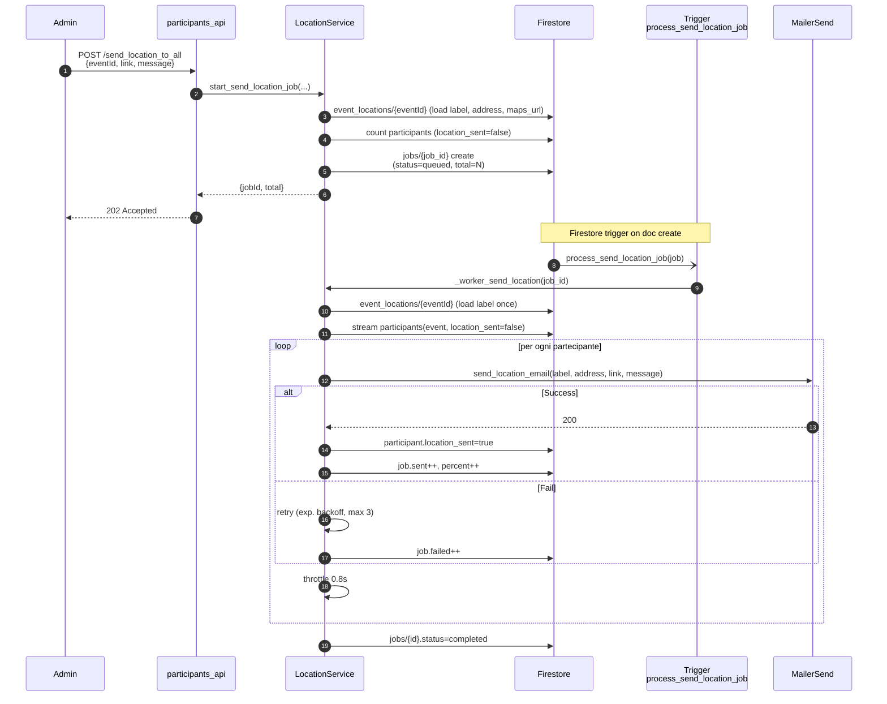
```mermaid
sequenceDiagram
    autonumber
    participant A as Admin
    participant API as participants_api
    participant LS as LocationService
    participant FS as Firestore
    participant TR as Trigger<br/>process_send_location_job
    participant MS as MailerSend

    A->>API: POST /send_location_to_all<br/>{eventId, link, message}
    API->>LS: start_send_location_job(...)
    LS->>FS: event_locations/{eventId} (load label, address, maps_url)
    LS->>FS: count participants (location_sent=false)
    LS->>FS: jobs/{job_id} create<br/>(status=queued, total=N)
    LS-->>API: {jobId, total}
    API-->>A: 202 Accepted

    Note over FS,TR: Firestore trigger on doc create
    FS-)TR: process_send_location_job(job)
    TR->>LS: _worker_send_location(job_id)
    LS->>FS: event_locations/{eventId} (load label once)
    LS->>FS: stream participants(event, location_sent=false)

    loop per ogni partecipante
        LS->>MS: send_location_email(label, address, link, message)
        alt Success
            MS-->>LS: 200
            LS->>FS: participant.location_sent=true
            LS->>FS: job.sent++, percent++
        else Fail
            LS->>LS: retry (exp. backoff, max 3)
            LS->>FS: job.failed++
        end
        LS->>LS: throttle 0.8s
    end
    LS->>FS: jobs/{id}.status=completed
```

**Parametri retry** (`config/location_config.py`):
- `LOCATION_MAX_RETRIES = 5`
- `LOCATION_BASE_DELAY = 1.0` s (backoff esponenziale)
- `LOCATION_MAX_DELAY = 30.0` s
- `LOCATION_MIN_INTERVAL = 0.8` s (throttling)

**Collections**: `jobs` (write + updates), `events` (read), `event_locations` (read), `participants_event` (read + `location_sent` update).

---

### UC-24: Gestione Location Evento (Admin)

**Attore**: admin che configura e pubblica la location di un evento.

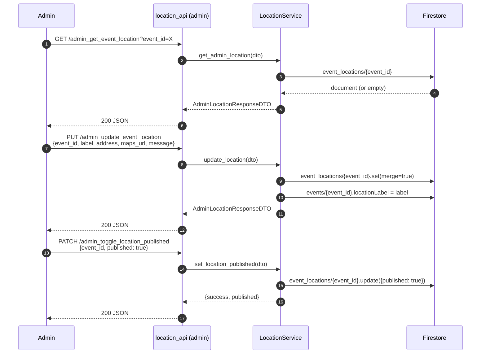
```mermaid
sequenceDiagram
    autonumber
    participant A as Admin
    participant API as location_api (admin)
    participant LS as LocationService
    participant FS as Firestore

    A->>API: GET /admin_get_event_location?event_id=X
    API->>LS: get_admin_location(dto)
    LS->>FS: event_locations/{event_id}
    FS-->>LS: document (or empty)
    LS-->>API: AdminLocationResponseDTO
    API-->>A: 200 JSON

    A->>API: PUT /admin_update_event_location<br/>{event_id, label, address, maps_url, message}
    API->>LS: update_location(dto)
    LS->>FS: event_locations/{event_id}.set(merge=true)
    LS->>FS: events/{event_id}.locationLabel = label
    LS-->>API: AdminLocationResponseDTO
    API-->>A: 200 JSON

    A->>API: PATCH /admin_toggle_location_published<br/>{event_id, published: true}
    API->>LS: set_location_published(dto)
    LS->>FS: event_locations/{event_id}.update({published: true})
    LS-->>API: {success, published}
    API-->>A: 200 JSON
```

**Collections**: `event_locations` (read/write), `events` (write — `locationLabel` denorm).

---

### UC-11: Gestione Membership

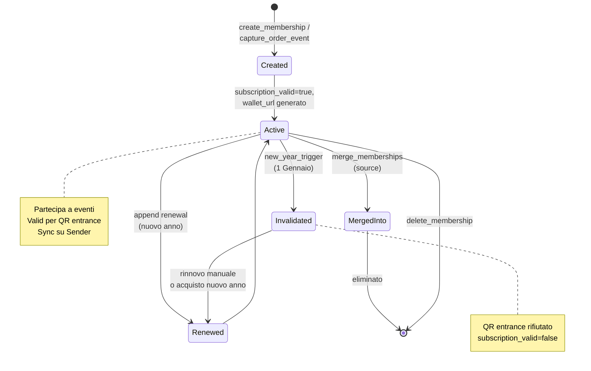
```mermaid
stateDiagram-v2
    [*] --> Created: create_membership /<br/>capture_order_event
    Created --> Active: subscription_valid=true,<br/>wallet_url generato
    Active --> Renewed: append renewal<br/>(nuovo anno)
    Renewed --> Active
    Active --> Invalidated: new_year_trigger<br/>(1 Gennaio)
    Invalidated --> Renewed: rinnovo manuale<br/>o acquisto nuovo anno
    Active --> MergedInto: merge_memberships<br/>(source)
    MergedInto --> [*]: eliminato
    Active --> [*]: delete_membership

    note right of Active
        Partecipa a eventi
        Valid per QR entrance
        Sync su Sender
    end note

    note right of Invalidated
        QR entrance rifiutato
        subscription_valid=false
    end note
```

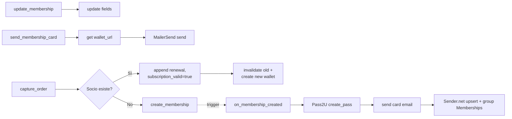
```mermaid
flowchart LR
    Create[create_membership] -.trigger.-> MC[on_membership_created]
    MC --> P2U[Pass2U create_pass]
    P2U --> Card[send card email]
    Card --> SnSync[Sender.net upsert + group Memberships]

    Update[update_membership] --> Fields[update fields]

    SendCard[send_membership_card] --> FetchURL[get wallet_url]
    FetchURL --> SendMail[MailerSend send]

    Renewal[capture_order] --> IsMember{Socio esiste?}
    IsMember -->|Sì| AppendRenewal[append renewal,<br/>subscription_valid=true]
    IsMember -->|No| Create
    AppendRenewal --> RegenWallet[invalidate old +<br/>create new wallet]
```

---

### UC-12: Merge Membership Duplicate

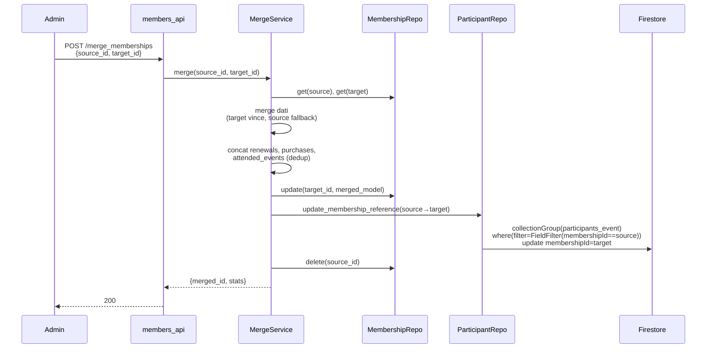
```mermaid
sequenceDiagram
    participant A as Admin
    participant API as members_api
    participant MS as MergeService
    participant MR as MembershipRepo
    participant PR as ParticipantRepo
    participant FS as Firestore

    A->>API: POST /merge_memberships<br/>{source_id, target_id}
    API->>MS: merge(source_id, target_id)
    MS->>MR: get(source), get(target)
    MS->>MS: merge dati<br/>(target vince, source fallback)
    MS->>MS: concat renewals, purchases,<br/>attended_events (dedup)
    MS->>MR: update(target_id, merged_model)
    MS->>PR: update_membership_reference(source→target)
    PR->>FS: collectionGroup(participants_event)<br/>where(filter=FieldFilter(membershipId==source))<br/>update membershipId=target
    MS->>MR: delete(source_id)
    MS-->>API: {merged_id, stats}
    API-->>A: 200
```

---

### UC-13: Wallet Pass Pass2U

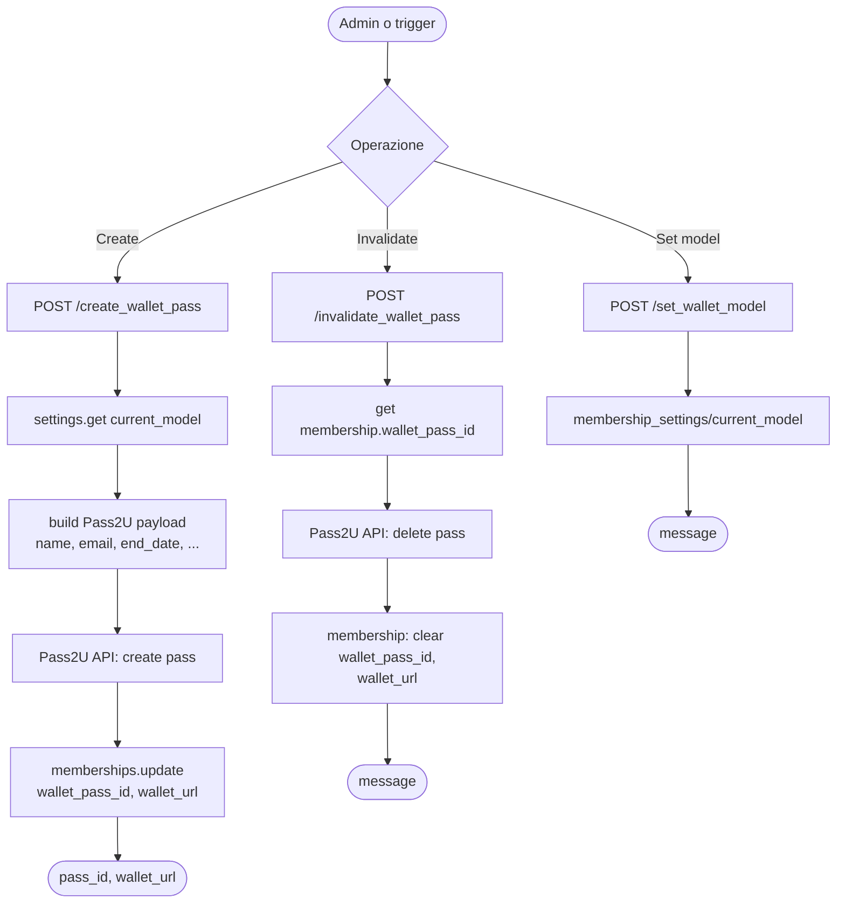
```mermaid
flowchart TD
    Start([Admin o trigger]) --> Op{Operazione}

    Op -->|Create| Create[POST /create_wallet_pass]
    Create --> FetchModel[settings.get current_model]
    FetchModel --> BuildPayload[build Pass2U payload<br/>name, email, end_date, ...]
    BuildPayload --> APICreate[Pass2U API: create pass]
    APICreate --> Store[memberships.update<br/>wallet_pass_id, wallet_url]
    Store --> Return1(["pass_id, wallet_url"])

    Op -->|Invalidate| Inv[POST /invalidate_wallet_pass]
    Inv --> GetPassId[get membership.wallet_pass_id]
    GetPassId --> APIDelete[Pass2U API: delete pass]
    APIDelete --> Clear[membership: clear wallet_pass_id,<br/>wallet_url]
    Clear --> Return2(["message"])

    Op -->|Set model| SetModel[POST /set_wallet_model]
    SetModel --> SaveModel[membership_settings/current_model]
    SaveModel --> Return3(["message"])
```

---

## 6. Use Cases Entrata Evento (QR)

### UC-14: Generazione Scan Token

```mermaid
sequenceDiagram
    participant A as Admin
    participant API as entrance
    participant ES as EntranceService
    participant FS as Firestore

    A->>API: POST /entrance_generate_scan_token<br/>{event_id}
    API->>ES: generate_scan_token(event_id, admin_uid)
    ES->>FS: events/{id} (verifica)
    ES->>ES: secrets.token_hex(16)
    ES->>FS: scan_tokens/{token} = {<br/>  event_id, created_by,<br/>  expires_at (now+12h),<br/>  is_active=true<br/>}
    ES-->>API: {token, scan_url}
    API-->>A: 200
```

---

### UC-15: Validazione Accesso Tramite QR

**Scenario**: partecipante arriva all'evento, hostess scansiona il suo QR code (membership_id), mentre il dispositivo ha già caricato un scan_token specifico per l'evento.

```mermaid
sequenceDiagram
    autonumber
    participant H as Hostess (scanner)
    participant API as entrance
    participant ES as EntranceService
    participant FS as Firestore

    H->>API: POST /entrance_validate<br/>{membership_id, scan_token}
    API->>ES: validate_entry(...)

    Note over ES: STEP 1 — Token
    ES->>FS: scan_tokens/{token}
    alt Token mancante o inactive o scaduto
        ES-->>API: result=invalid_token
        API-->>H: 200 { result }
    end

    Note over ES: STEP 2 — Membership
    ES->>FS: memberships/{id}
    alt Non esiste
        ES-->>API: result=invalid_member_not_found
    end
    alt subscription_valid = false
        ES-->>API: result=invalid_membership
    end

    Note over ES: STEP 3 — Biglietto evento
    ES->>FS: collectionGroup(participants_event)<br/>where membership_id==X<br/>filter event_id
    alt Nessun biglietto
        ES-->>API: result=invalid_no_purchase
    end

    Note over ES: STEP 4 — Già entrato?
    ES->>FS: entrance_scans/{event}/scans/{memb_id}
    alt Esiste già
        ES-->>API: result=already_scanned<br/>{scanned_at}
    end

    Note over ES: STEP 5 — Registra entrata
    ES->>FS: entrance_scans/{event}/scans/{memb_id}.set({<br/>  scanned_at=SERVER_TIMESTAMP,<br/>  scan_token<br/>})
    ES->>FS: participant.update({entered=true,<br/>  entered_at=SERVER_TIMESTAMP})
    ES-->>API: result=valid, {member, counts}
    API-->>H: 200 JSON
```

**Stati risposta**:
| Result | Significato |
|---|---|
| `valid` | Ingresso registrato correttamente |
| `already_scanned` | Membro già entrato (con timestamp) |
| `invalid_token` | Token QR assente/scaduto/revocato |
| `invalid_membership` | `subscription_valid=false` |
| `invalid_member_not_found` | Membership non esistente |
| `invalid_no_purchase` | Socio non ha biglietto per questo evento |

**Manual entry** (`entrance_manual_entry`): bypassa step 1-3 (admin autenticato), ma permette anche l'**undo** (`entered=false`) cancellando il record da `entrance_scans`.

---

## 7. Triggers Automatici

### UC-16: Trigger `on_participant_created`

**Fires**: a ogni nuovo documento in `participants/{eventId}/participants_event/{participantId}`.

```mermaid
flowchart TD
    A[Participant created in Firestore] --> B{gender?}
    B -->|hardcoded 'andrea'| C[gender=male]
    B -->|else| D[Genderize.io API]
    D --> E[update gender + probability]
    C --> F
    E --> F

    F[Read event + membership info] --> G{send_ticket_on_create?}
    G -->|true| H[TicketService.process_new_ticket]
    H --> I[Generate PDF<br/>Cloud Storage upload]
    I --> J[MailerSend: send ticket email]
    J --> K[participant.ticket_sent=true]
    G -->|false| K
    K --> L{newsletter_consent?}
    L -->|true| M["Sender.net: sync_participant<br/>+ Newsletter + Participant-(event)"]
    L -->|false| End
    M --> End([Done])

    style B fill:#ffe4b5
    style H fill:#e4f0ff
    style M fill:#fff4e4
```

**Errori non bloccanti**: tutte le API esterne sono incapsulate in try/except, failure → `error_logs` + continue.

---

### UC-17: Trigger `on_membership_created`

**Fires**: a ogni nuovo documento in `memberships/{membershipId}`.

```mermaid
flowchart TD
    A[Membership created] --> B[Pass2UService.create_membership_pass]
    B --> C[settings.get current_model]
    C --> D[Pass2U API: create pass]
    D --> E[update wallet_pass_id, wallet_url]
    E --> F{send_card_on_create?}
    F -->|true| G[Build card email with wallet_url]
    G --> H[MailerSend send]
    H --> I[membership.membership_sent=true]
    F -->|false| J[skip email]
    I --> K[Sender.net: sync_membership<br/>+ group Memberships]
    J --> K
    K --> End([Done])

    style B fill:#e4f0ff
    style K fill:#fff4e4
```

---

### UC-18: Trigger Jobs (Invio Posizione)

Vedi [UC-10](#uc-10-invio-posizione-massivo-async-job) per il diagramma completo. Il trigger è il *consumer* del Job pattern:

```mermaid
graph LR
    A[Admin crea Job doc] --> B[Firestore trigger]
    B --> C[Worker<br/>_worker_send_location]
    C --> D[Iterate participants]
    D --> E[Email + retry + throttle]
    E --> F[Update job progress]
    F --> G{Tutti processati?}
    G -->|No| D
    G -->|Sì| H[job.status=completed]
```

---

### UC-19: Trigger Capodanno (Rinnovi)

**Fires**: scheduled `0 0 1 1 *` (1° Gennaio 00:00 Europe/Rome).

```mermaid
sequenceDiagram
    participant SCH as Cloud Scheduler
    participant TR as new_year_trigger
    participant FS as Firestore

    SCH-)TR: invalidate_memberships_new_year()
    TR->>FS: memberships.where(filter=FieldFilter(subscription_valid==true))
    loop batch di 500
        TR->>FS: batch.update(subscription_valid=false)
        TR->>FS: batch.commit()
    end
    TR->>TR: log result
```

**Effetto**: tutte le membership dell'anno precedente bloccate al QR entrance; riattivate su nuovo rinnovo tramite `append_renewal`.

---

## 8. Webhooks

### UC-20: Sender.net Webhook

**Eventi gestiti**: `subscriber.unsubscribed`, `subscriber.bounced`, `subscriber.spam_reported`.

```mermaid
sequenceDiagram
    participant SN as Sender.net
    participant API as sender_webhook_api
    participant NR as NewsletterRepository
    participant FS as Firestore

    SN->>API: POST /sender_webhook<br/>X-Sender-Token: secret<br/>{event, data: {email}}
    alt Token mismatch
        API-->>SN: 200 (fail silent)
    end
    API->>API: parse event type
    alt event ∈ {unsubscribed, bounced, spam}
        API->>NR: unsubscribe_by_email(email)
        NR->>FS: newsletter_signups<br/>where(filter=FieldFilter(email==...)).update(active=false)
        NR->>FS: newsletter_consents<br/>where(filter=FieldFilter(email==...)).update(status=...)
    end
    API-->>SN: 200 OK (sempre)
```

**Security**: header `X-Sender-Token` validato contro `SENDER_WEBHOOK_SECRET`. Fail-open se secret non configurato.

---

## 8b. Area Soci (Member API)

### UC-21: Autenticazione Membro — Magic Link

**Attore**: socio che accede all'area riservata tramite link via email (passwordless).

```mermaid
sequenceDiagram
    autonumber
    participant U as Socio
    participant FE as Next.js /login
    participant FA as Firebase Auth
    participant VE as /login/verify
    participant MW as middleware.js

    U->>FE: inserisce email → "Invia link"
    FE->>FA: sendSignInLinkToEmail(email, actionCodeSettings)
    FA-->>U: email con magic link
    U->>VE: click link → signInWithEmailLink()
    VE->>FA: signInWithEmailLink(email, url)
    FA-->>VE: idToken
    VE->>VE: set cookie mcp_auth_token = idToken
    VE->>U: redirect → /dashboard

    U->>MW: GET /dashboard/*
    MW->>MW: verifica cookie mcp_auth_token
    alt cookie assente
        MW-->>U: redirect /login
    else cookie presente
        MW-->>U: page served
    end
```

**Note**:
- Admin usa flusso separato: `LoginModal` con email+password (`signInWithEmailAndPassword`).
- `mcp_auth_token` cookie è letto dal frontend per le chiamate `memberFetch` (`auth.currentUser.getIdToken()`).
- Firebase console: abilitare "Email link (passwordless sign-in)" in Authentication → Sign-in methods.

---

### UC-22: Dashboard Socio (Profilo, Storico, Preferenze)

**Attore**: socio autenticato tramite magic link.

```mermaid
sequenceDiagram
    autonumber
    participant U as Socio
    participant FE as /dashboard
    participant API as api/member/*
    participant FS as Firestore

    U->>FE: apre /dashboard
    FE->>API: GET /member_get_me (Bearer idToken)
    API->>API: @member_endpoint → verifica idToken
    API->>FS: memberships.where(email == token.email).limit(1)
    FS-->>API: membership doc
    API-->>FE: {name, subscription_valid, end_date, renewals, card_url, wallet_url, ...}

    FE->>API: GET /member_get_events
    API->>FS: per ogni attended_event_id → get event doc
    API-->>FE: [{id, title, date, location_hint, image}]

    FE->>API: GET /member_get_purchases
    API->>FS: per ogni purchase_id → get purchase doc → get event title
    API-->>FE: [{id, type, amount_total, currency, timestamp, event_title}]

    U->>FE: modifica newsletter_consent → "Salva"
    FE->>API: PATCH /member_patch_preferences {newsletter_consent}
    API->>FS: memberships/{id}.update({newsletter_consent})
    API->>API: Sender.net sync (best-effort)
    API-->>FE: {success: true}
```

**Collections**: `memberships` (read/write), `events` (read), `purchases` (read).

---

### UC-23: Socio Consulta Location Evento

**Attore**: socio autenticato che consulta la location di un evento al quale è iscritto.

```mermaid
sequenceDiagram
    autonumber
    participant U as Socio
    participant FE as /events/[slug]/guide
    participant API as api/member/location_api
    participant FS as Firestore

    U->>FE: apre pagina guida evento
    FE->>API: GET /member_get_event_location?event_id=X
    API->>API: @member_endpoint → verifica idToken
    API->>FS: event_locations/{event_id}
    alt published = false
        API-->>FE: 404 Not Found
        FE->>U: location non ancora disponibile
    else published = true
        API-->>FE: {label, address, maps_url, maps_embed_url, message}
        FE->>U: mostra venue + mappa
    end
```

**Collections**: `event_locations` (read).  
**Protezione**: solo accessibile con idToken valido (decorator `@member_endpoint`); `published=false` ritorna 404.

---

## 9. Integrazioni Esterne

### PayPal — Payment Processing

```mermaid
sequenceDiagram
    participant MCP as MCP Backend
    participant PP as PayPal API

    Note over MCP: Create Order
    MCP->>PP: POST /v2/checkout/orders<br/>{intent:CAPTURE, purchase_units}
    PP-->>MCP: {order_id, approve_url, status:CREATED}

    Note over MCP: User approva redirect
    MCP->>PP: POST /v2/checkout/orders/{id}/capture
    PP-->>MCP: {status:COMPLETED, payer, capture {id, amount, seller_receivable_breakdown}}
```

**Dati scambiati**: reference_id (event_id), amount, currency, buyer email.  
**Dati conservati in MCP**: transaction_id, paypal_fee, net_amount, payer_info → `purchases/{id}`.

---

### MailerSend — Email Transazionale

```mermaid
graph LR
    subgraph MCP
        A[MailService.send]
    end
    subgraph MailerSend
        B[API]
        C[Template Engine]
        D[Delivery]
    end
    A -->|POST /email| B
    B --> C --> D
    D -->|SMTP| E[Destinatario]
```

**Invocato in**:
- Ticket send (UC-16)
- Membership card (UC-17)
- Location send (UC-10, UC-18)
- Contact reply, contact form (UC-06)
- Newsletter welcome (UC-05)
- Omaggio emails

**Mittenti per categoria**: `MAILERSEND_FROM_EMAIL_MEMBERSHIPS`, `..._TICKETS`, `..._NEWSLETTER`, ecc.

---

### Pass2U — Wallet Digitale

```mermaid
sequenceDiagram
    participant MCP
    participant P2U as Pass2U API

    MCP->>P2U: POST /v2/models/{model_id}/passes<br/>{name, email, end_date, ...}
    P2U-->>MCP: {pass_id, url (apple/google wallet)}

    Note over MCP: ...più tardi...

    MCP->>P2U: DELETE /v2/passes/{pass_id}
    P2U-->>MCP: 204 No Content
```

**Model ID**: salvato in `membership_settings/current_model`, modificabile da admin.

---

### Sender.net — CRM/Email Marketing

```mermaid
flowchart LR
    subgraph Triggers
        A[on_participant_created]
        B[on_membership_created]
        C[newsletter_signup]
    end
    subgraph Webhooks
        D[sender_webhook]
    end
    subgraph Sender
        SN_API[Sender.net API]
        SN_Subs[Subscribers]
        SN_Groups["Dynamic Groups<br/>Participant-(event)"]
    end

    A -->|sync_participant_to_sender| SN_API
    B -->|sync_membership_to_sender| SN_API
    C -->|sync_newsletter_signup_to_sender| SN_API
    SN_API --> SN_Subs
    SN_API --> SN_Groups

    D -->|POST unsubscribe event| DB[(newsletter_signups<br/>newsletter_consents)]
```

---

### Genderize.io — Gender Detection

Usato in:
- `domain/participant_rules.py` → validazione eventi `onlyFemales`
- `triggers/registration_trigger.py` → arricchimento dati partecipante

```
GET https://api.genderize.io/?name=Maria
→ {"name":"maria","gender":"female","probability":0.98,"count":82461}
```

Fallback: se API down o nome sconosciuto, il genere non viene impostato (gestione graceful).

---

## 10. State Machines

### Event Lifecycle

```mermaid
stateDiagram-v2
    [*] --> draft: create_event
    draft --> coming_soon
    coming_soon --> active: vendita aperta
    active --> sold_out: max raggiunto
    active --> ended: data passata
    sold_out --> ended
    coming_soon --> ended
    ended --> [*]: delete_event
```

### Order / Purchase Lifecycle

```mermaid
stateDiagram-v2
    [*] --> Staged: orders/{id} created<br/>(create_order_event)
    Staged --> Captured: capture_order_event<br/>(PayPal COMPLETED)
    Staged --> Abandoned: utente non paga
    Captured --> Stored: purchases/{id} created
    Stored --> [*]: orders/{id} deleted
    Abandoned --> [*]: cleanup (manuale/TTL)
```

### Participant Ticket & Entry Lifecycle

```mermaid
stateDiagram-v2
    [*] --> Registered: create participant
    Registered --> TicketSent: trigger → ticket PDF + email
    TicketSent --> LocationSent: send_location
    LocationSent --> Entered: QR scan (entrance_validate)
    TicketSent --> Entered: senza location
    Entered --> [*]: evento concluso

    note right of Registered
        gender detection via Genderize
        sync newsletter su consent
    end note
```

### Membership Lifecycle

```mermaid
stateDiagram-v2
    [*] --> Pending: create
    Pending --> Active: trigger completato<br/>(wallet + email + sync)
    Active --> Renewed: nuovo rinnovo annuale
    Renewed --> Active
    Active --> Invalidated: 1 Gennaio<br/>(new_year_trigger)
    Invalidated --> Renewed: rinnovo anno nuovo
    Active --> Merged: merge_memberships
    Merged --> [*]
    Active --> [*]: delete

    note right of Active
        wallet_pass_id presente
        subscription_valid = true
    end note
```

### Job (Send Location) Lifecycle

```mermaid
stateDiagram-v2
    [*] --> queued: admin click
    queued --> running: trigger pickup
    running --> running: per-participant<br/>send + retry
    running --> completed: tutti processati
    running --> failed: eccezione fatale
    completed --> [*]
    failed --> [*]
```

---

## 11. Matrice Collections ↔ Use Cases

Legenda: **R**=read · **W**=write · **D**=delete · **T**=triggers

| Collection | UC-01 | UC-02 | UC-03 | UC-04 | UC-05 | UC-06 | UC-08 | UC-09 | UC-10 | UC-11 | UC-12 | UC-14 | UC-15 | UC-16 | UC-17 | UC-19 | UC-20 | UC-22 | UC-23 | UC-24 |
|---|:-:|:-:|:-:|:-:|:-:|:-:|:-:|:-:|:-:|:-:|:-:|:-:|:-:|:-:|:-:|:-:|:-:|:-:|:-:|:-:|
| `events` | R | R | R | R |  |  | RWD | R | R |  |  | R | R | R |  |  |  | R |  | W |
| `event_locations` |  |  |  |  |  |  |  |  | R |  |  |  |  |  |  |  |  |  | R | RW |
| `memberships` |  | R | R | RW |  |  |  | RW |  | RWD | RWD |  | R |  | RW | W |  | RW |  |  |
| `participants_event` |  | R | R | W |  |  | D | RWD | RW |  | W |  | RW | RW |  |  |  |  |  |  |
| `purchases` |  |  |  | W |  |  |  |  |  |  |  |  |  |  |  |  |  | R |  |  |
| `orders` |  |  | W | RD |  |  |  |  |  |  |  |  |  |  |  |  |  |  |  |  |
| `jobs` |  |  |  |  |  |  |  |  | RW |  |  |  |  |  |  |  |  |  |  |  |
| `newsletter_signups` |  |  |  |  | RW |  |  |  |  |  |  |  |  | W |  |  | W |  |  |  |
| `newsletter_consents` |  |  |  |  |  |  |  |  |  |  |  |  |  | W |  |  | W |  |  |  |
| `contact_messages` |  |  |  |  |  | W |  |  |  |  |  |  |  |  |  |  |  |  |  |  |
| `scan_tokens` |  |  |  |  |  |  |  |  |  |  |  | W | R |  |  |  |  |  |  |  |
| `entrance_scans` |  |  |  |  |  |  |  |  |  |  |  |  | RW |  |  |  |  |  |  |  |
| `membership_settings` |  |  | R | R |  |  |  |  |  | RW |  |  |  |  | R |  |  |  |  |  |
| `error_logs` |  |  | W | W | W | W | W | W | W | W | W | W | W | W | W | W |  |  |  |  |

---

## Riferimenti al Codice

| Componente | Path |
|---|---|
| Entry point | [functions/main.py](functions/main.py) |
| API pubbliche | [functions/api/public/](functions/api/public/) |
| API admin | [functions/api/admin/](functions/api/admin/) |
| Entrance | [functions/api/entrance.py](functions/api/entrance.py) |
| Services | [functions/services/](functions/services/) |
| Domain rules | [functions/domain/](functions/domain/) |
| Repositories | [functions/repositories/](functions/repositories/) |
| Triggers | [functions/triggers/](functions/triggers/) |
| Config | [functions/config/](functions/config/) |
| Tests | [functions/tests/unit/](functions/tests/unit/) |

---

*Documentazione derivata dall'analisi completa del codice — aggiornata al 2026-05-09.*
